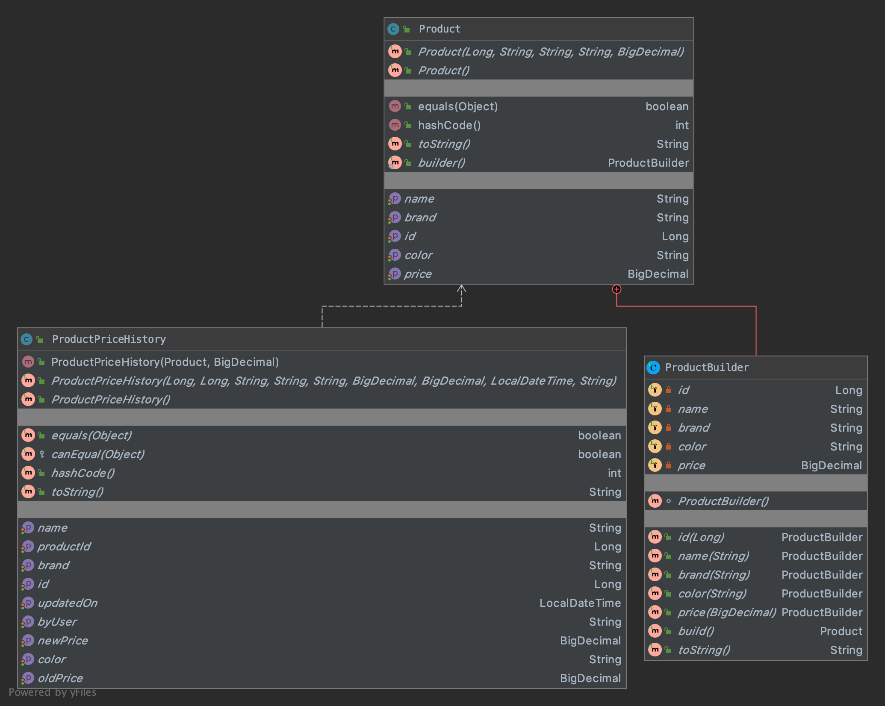

# REST Microservices architecture for E-commerce
**Spring-Boot e-commerce app with Microservices architecture using Spring Cloud**

- [Requirements](#Requirements)
    - [Technologies](#Technologies)
    - [Features](#Features)
- [Project architecture](#Project-architecture)  
    - [High-level design](#high-level-design)  
    - [Detail design](#Detail-design)  
        - [Product Service](#Product-Service)  
        - [Audit Service](#Audit-Service)  
        - [Cart Service](#Cart-Service)  
        - [Order Service](#Order-Service)  
        - [Authentication Service](#Authentication-service)  
        - [Product Service](#Product-Service)  
        - [Spring Cloud components](#Spring-Cloud-components)  
- [Build and Deploy](#Build-and-Deploy)      
        - [Setup development workspace](#Setup-development-workspace)      
        - [Deploy Using Docker](#deploy-using-docker-by-one-click)      
        - [Run the applications with Maven](#Run-the-applications-with-Maven)          
- [Monitor](#Monitor)      
        - [ Distributed tracing Zipkin](#Distributed-tracing-Zipkin)      
        - [ Admin server to monitor services](#Admin-server-to-monitor-services)     
- [USAGE &  URLs](#usage--urls)          

## Requirements
A small start-up wants to build a very simple online shopping
application to sell their products. In order to get to the market quickly, they just want
to build an MVP version... For more details, plz drop a message to me

### Technologies
- Java 11
- Spring Boot 2
- Spring Cloud
- Docker

### Features:
1. User authentication and access control using Spring Security Oauth2 with Json Web Token 
2. Spring actuator to monitor API usage including /health endpoint
3. OpenAPI/Swagger for API documentation
4. Spring Boot based Restful API including Validation, Exception Handling
7. Interacting with RabbitMQ server to publish and subscribe messages for auditing
8. Hibernate Level 2 caching with EhCache

## Project architecture
### High-level design

- **Product Service**: manages our products with CRUD operations. This service also provides the ability to allow user could filter, sort and search for products based on dynamic criteria.
- **Audit Service**: records all customers activities (filtering, sorting, viewing product detail).
- **Cart Service**: manages customers shopping carts with CRUD operations.
- **Order Service**: manages customer orders with CRUD operations.
- **Config server**: a module that uses Spring Cloud Config Server for running configuration server in the native mode. The configuration files are placed on the classpath.
- **Discovery Service** - an embedded discovery server.
- **Authentication Service**: authenticates customers, integrates with 3rd party identity platform like Facebook, Google...
- **API Gateway**: Route requests to multiple services using a single endpoint. This service allows us to expose multiple services on a single endpoint and route to the appropriate service based on the request.
- **Tracing server**: using Spring Cloud Sleuth and Zipkin in order to gather timing data for every request propagated between independent services
- **Admin server**: monitoring Microservices With Spring Boot Admin
### Detail design


#### Product Service
The Product service stores information about all of our product. The storage requirements for the Product are:
- Long-term storage.
- Read-heavy (it's common for ecommerce application because the traffic from users to view, search, sort product are always much higher than the traffic from administrators to update product's information).
- Need complex joins 

A relational database: Postgresql is selected. For the simplicity of the assignment, we simplify the data schema like this:


- To support customer filter, sort and search for products based on dynamic criteria, we have 2 options: *Spring Specification* and *QueryDSL*. Here we go with *QueryDSL* because it simplify the implementation.
- To keep track all customer activity, we need to record all customer request parameters when client send GET request to our endpoint to view product detail or to filtering/sorting products. We use *Spring AOP* and define the PointCut to tell Spring which part of the code should be monitored, we also define Advice method to tell Spring how to record these parameters.
- To make sure failure to store customer activity is completely transparent to customer and should have no impact to the activity itself, we use *Spring Async* to run our AOP Advice in a separate thread.
- We use *Spring Cloud Stream* to send all customer activity data from Product Service to a message broker. In our case, Product Service acts as a message *Source*, and Audit Service acts as a message *Sink*. We don't want data will not be lost if Audit Service was temporary down, so we config queue as durable queue for guaranteed message delivery.

#### Audit Service
The Audit service listens for customer activities from the Product service. The storage requirements for the Audit service are:
- Long-term storage.
- Non-relational data.
- Able to handle massive amount a data (read-heavy as we mentioned in Product section above).
- Dynamic or flexible schema.


- Audit Service acts as a message Sink, it consumes and process message (message is customer activity in our case). And store to MongoDB.

#### Cart Service
The Shopping Cart service stores information about shopping cart of the customers. The storage requirements for the Shopping Cart Service are:
- Short-term storage. Each customer will have their own shopping cart and only one shopping cart at the moment. After customer checkout, the shopping cart data will be cleared.
- Need retrieve/lookup shopping cart data quickly and update shopping cart data quickly
- Support only 1 simple query: query by customer.

The HashMap data structure (with the key is customer and the value is shopping cart data) seems meet our needs because the get and put operations take only constant time.
The HashMap data structure (with the key is customer and the value is shopping cart data) seems meet our needs because the get and put operations take only constant time.


#### Order Service
The Order service stores information about all of our customer orders. The storage requirements for the Order are:
- Long-term storage.
- Able to handle a high volume of packages, requiring high write throughput
- Support simple queries. No complex joins or requirements for referential integrity.

Because the order data is simple and not relational, a document-oriented database is appropriate, and MongoDB can achieve high throughput and scale well


#### Authentication service
To simplify the setup, using [Okta](https://www.okta.com/products/customer-identity/authentication/) - an Identity Cloud Service


### Spring Cloud components
1. Eureka for Microservice Registration and Discovery and Dynamic scaling
2. Netflix-zuul for API Gateway
3. Feign for declarative REST client for Microservices
4. Client side load balancing using Ribbon
5. Hystrix for fault tolerance
6. Distributed Tracing using Spring Cloud Sleuth and Zipkin

## Build and Deploy
### Setup development workspace
The setup development workspace process is simpler than ever with following steps:
1. Install [JDK 11](https://www.oracle.com/java/technologies/javase-jdk11-downloads.html).
1. Install [Docker for Desktop](https://www.docker.com/products/docker-desktop).
1. Install [Maven](https://maven.apache.org/download.cgi?Preferred=ftp://mirror.reverse.net/pub/apache/).
1. Clone this project to your local machine.

### Deploy Using Docker (*by one Click*)
- From project root, run build all service packages

    ```$ mvn clean compile package -DskipTests ```
- Run docker compose from project root, it might take more than 5 minutes to complete. Please take a cup of coffee while waiting for :) 

  ```$ docker-compose up --build```
- Navigate to http://localhost:8060/login to view running app

**NOTE**: Increase DockerVM Ram, Cpu to make better performance
- And shutdown this docker compose
    
    ```$ docker-compose down --remove-orphans```


### Run the applications with Maven
- From project root, run build all service packages

    ```$ mvn clean compile install -DskipTests ```
- From project root, navigate to **tool_essentials** to running essential tools for the project like database, rabbitmq, ...

    - ```$ cd  tool_essentials```
    - ```$ docker-compose up --build ```
    
- Navigate to each service and run config service then discovery service, and after that start api gateway, product service, audit service, cart service, order service later on 

    - ```$ mvn spring-boot:run```
## Monitor
### Distributed tracing Zipkin
    
### Admin server to monitor services


## USAGE & URLs
After running up the services, go to [Swagger UI](http://localhost:8060/swagger-ui.html) to play around with the apis journey. 
Before of that, [login](http://localhost:8060/login) first then copy the accessToken then pasting into Authorization box withe the format: Bearer {token} 

Account to login: test1@mail.com/ !P@ssw0rd

|     Application       |     URL          |
| ------------- | ------------- |
| iCommerce Api | http://localhost:8060/swagger-ui.html |
| Eureka | http://localhost:8061/|
| Zipkin | http://localhost:9411/zipkin/ |


> It always seems impossible until it's done. - Nelson Mandela